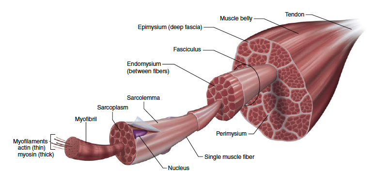
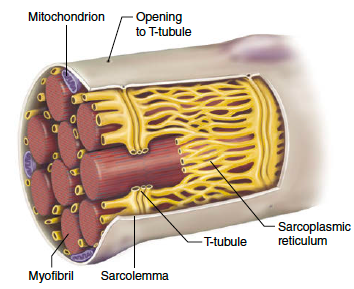
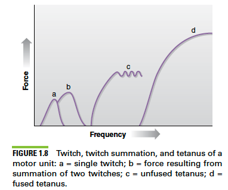
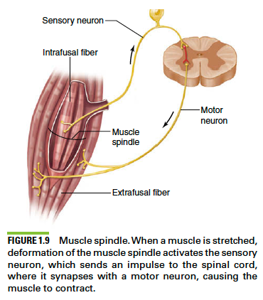
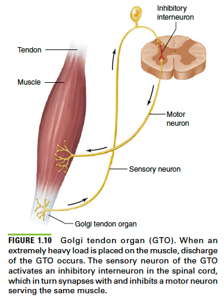

# Structure and Function of Body Systems

Outline:

- describe both the **macrostructure** and **microstructure** of muscle and bone
- describe the **sliding-filament theory** of muscular contraction
- describe the specific morphological and physiological characteristics of **different** **muscle fiber types** and predict their relative involvement in differernt sport events 
- describe the anatomical and physiological characteristics of the cardiovascular and respiratory systems

## Musculoskeletal System

The musculoskeletal system of the human body consists of:

- bones
- joints
- musces
- tendons

### Skeleton

人任何的movement, 都是通过肌肉发力 (only pulling) 在骨骼上完成的。人身体里有大约206根骨头，分为两个大类:

- `axial skeleton`: 中间的轴，从上到下包括skull, vertebral column, ribs and sternum.
- `appendicular skeleton`: 沿着axis, 周围的包括shoulder gridle, bones of arms and wrists.

bone和bone之间连接的地方叫做关节 (joint), 根据关节自由度分类, 有以下这么几种种类

| joint type           | ROM                         | example              |
| -------------------- | --------------------------- | -------------------- |
| Fibrous joint        | allow virtually no movement | sutures of the skull |
| Cartilaginous joints | allow limited movement      | intervertebral disk  |
| Synovial joint       | allow considerable movement | elbow and knee       |

和运动相关的，主要是synovial joint类型，同时要支持large range of motion (ROM) and low friction, 人体为了满足这些需求，演化出了这么几个characteristics:

- `Hyaline cartilage`: hyaline stands for transparent appearance.  也就是附着在骨头上的**透明状软骨**， 一种无血管的connective tissue.
- 关节都有关节腔 (capsule), 关节腔中有synovial fluid (关节液)
- 还有一些supporting structures of ligament and cartilage

### Skeletal Musculature

Skeletal musculature or skeletal muscle (骨骼肌) 顾名思义，是直接连接skeleton bones的肌群. bone和骨骼肌连接处，有的是tendon (肌腱), 也是一种一种结缔组织.

#### Musculoskeletal Macrostructure and Microstructure

Muscle cell 或者在健身圈更popular的叫法muscle fiber (肌肉纤维), 直径在50-100 um, 和头发丝很接近, 肌肉和connective tissue是共生的关系. 我们接下来观察:

- what's outside of muscle fiber
- what's inside muscle fiber

**What's outside muscle fiber**

每一根肌纤维都被`endomysium` 所包围，许多根肌肉纤维被bundle在一起叫做fasciculi，连接这些bundle的叫做. 然后许多这样的bundle又被包裹在一起, 那层connective tissue叫做`Perimysium`， 自然的，这些bundle结合在一起，又称为muscle belly, 最外面那层connective tissue叫做`epimysium`, 这样由内而外这个结构叫做musculoskeletal microstructure.

Glossory 如下:

- `muscle fiber`: 肌肉纤维，形貌圆柱， 直径约50-100 um, 和头发丝粗细相当.

- `Endomysium`:  包裹着muscle fiber的connective tissue.
- `Fasciculus`: 上百根muscle fiber组成的bundle的学名.
- `perimysium`:  fasciculus周围包裹的另外一层connective tissue
- `Epimysium`: 许许多多bundle外面的最外层connective tissue.

要注意的是, 所有的connective tissue, `endomysium` , `perimysium` and `epimysium` 都和tendon相连接，都是connective tissue, 所以肌肉纤维中的tension, 会通过connective tissue transimit到tendon and to skeleton.

**what's inside muscle fiber**

`motor neuron (nerve cell)`  consists of dendrites, axon. motor neuron就像一个controller, 控制着许多muscle fibers. muscle fibers and motor neuron组成了一个motor unit, 是最基础的单位. muscle fiber 和 motor neuron的连接处叫做`neuromuscular junction`, 每根muscle fiber只有一个junction.  

> 在powerlifting中，typical program (3x3) for example, 力量的提升训练的很大一部分，是提升神经连接能力，这一个process, 被称为`recruitment` 也就是这个动作能够控制更多的motor units来完成某些lifting, 因此能够举起的重量也就更大了.

接下来我们看muscle fiber的内部, 每一根muscle fiber中的组成部分，如下图所示:

- `sacroplasm`: 是muscle fiber中的`cytoplasm` (细胞质), 由contractile components consisting of protein filaments, other proteins, stored glycogen (糖原，由葡萄糖脱水缩合作用而成) and fat particles, enzymes. 上图黄色的部分
- `Myofibril`: 成百上千的myofibril, 每一根直径约1um, 其中包含着负责肌肉拉伸的重要工具，主要由两种`myofilament`: myosin (肌球蛋白) and actin (肌动蛋白).
  - `myosin`: 肌球蛋白around 16 nm in diameter, myosin filament由globular head, a hinge point and a fibrous tail组成.
  - `actin`: 肌动蛋白大约6 nm in diameter, 双螺旋结构

由myosin and actin组成的单位，沿着水平方向排序组合成肌肉中的最小可拉伸单元，叫做`sacromere. ` 

- `Sarcomere`: around 2.5 um in length (每厘米肌肉有4500) 

> Sarcomere是muscle contration中最重要的分析单位, 这一部分的具体细节，可以看这个[animation](https://www.youtube.com/watch?v=BVcgO4p88AA)

#### Sliding-filament theory

简短来说，是指肌肉收缩的一个理论，mysin和actin组成的结构，进行滑动, 来使肌肉收缩.

由几个phase组成:

- resting phase
- Excitation-contraction coupling phase
- Contracation phase
- Recharge phase
- Relaxation Phase

**resting phase**

**Excitation-contraction coupling phase**

**contraction phase**

对于肌肉训练，最重要的一个环节, ATP进行hydrolysis 生成phosphate, ADP and 能量.

> 肌肉的收缩最重要的两个substance, ATP and calcium.

## Neuromuscular System

### Activation of Muscles

上一节我们讲过，motor unit = motor neuron + N x muscle fibers, 根据肌肉的职能以及对精度要求的高低，每个motor neuron需要控制的muscle fiber都不同，就像一台电脑，同时跑多个程序，和只需要执行一个程序，对cpu的占用率不同，速度也自然不同。举个例子，比如眼皮上的肌肉每个neuron只控制1个，但你的股四控制hundreds muscle fiber.

motor neuron的控制方法如下:

- neuron释放`acetylcholine` 一种neurotransmitter, 通过扩散进入`neuromuscular junction`, 激活sacrolemma.
- calcium 离子释放，进行定向移动，那么就会有电势差.
- motor unit中所有的muscle fiber统一contraction, 这叫做`all-or-none principle` of the muscle. 但你产生的电势大小和contraction强弱无关.

接下来我们要说一个概念, `twitch`, 电势是由calcium的定向流动产生的，电势会造成肌肉的短暂收缩，而这个短暂收缩叫做twitch. 这也对应着上一节说的那几个阶段, 发生的时间在msec

下图描述了1个或多个twitch的叠加效应，来提供maximum force produced.

twitching concepts在后面理解肌肉纤维的类别，起到至关重要的作用。

### Muscle Fiber Types

最常见的分类肌肉纤维的type, 是用twitch-time作为分类, 分为slow-twich fiber和fast-twitch fiber. 每一个motor unit中的muscle fiber的类型都是一样的.

- `fast twitch fiber`: develop force quickly and relaxes quickly. 所以twitch time非常短. 
- `slow twich fiber`: develop force and relaxes slowly.

> fast twitch fiber 是否就是爆发力的关键? 

根据twitch time, 肌纤维主要分为:

- `Type I (slow-twitch)`
- `Type IIa (fast-twitch)`
- `Type IIx (fast-twitch)`

而这两种肌肉纤维的主要区别是对于能量的供给的分配策略不同，自然会影响肌肉withstand fatigue的能力. 

主要的characteristics如下

| Characteristic                    | Type I | Type IIa          | Type IIx |
| --------------------------------- | ------ | ----------------- | -------- |
| Motor neuron size                 | Small  | Large             | Large    |
| Recruitment threshold             | Low    | Intermediate/High | High     |
| Nerve conduction velocity         | Slow   | Intermediate/High | High     |
| Contraction speed                 | Slow   | Fast              | Fast     |
| Relaxation speed                  | Slow   | Fast              | Fast     |
| Fatigue resistance                | High   | Intermediate/Low  | Low      |
| Endurance                         | High   | Intermediate/Low  | Low      |
| Force production                  | Low    | Intermediate      | High     |
| Power output                      | Low    | Intermediate/High | High     |
| Aerobic enzyme content            |        |                   |          |
| Anaerobic enzyme content          |        |                   |          |
| Sacroplasmic reticulum comlpexity |        |                   |          |
| Capillary density                 |        |                   |          |
| Myoglobin content                 |        |                   |          |
| Mitochondrial size, density       |        |                   |          |
| Fiber diameter                    |        |                   |          |
| Color                             |        |                   |          |

### Motor Unit Recruitment Patterns

相对比较熟悉，略

> Muscule force output can be varied through change in the frequency of activation of individual motor units or change in the number of activated motor units.

### Proprioception (本体感觉)

`Proprioceptors` 是坐落于joints, muscle and tendons的传感器, 对于pressure和tension都很敏感，可以传递信息给central nervous system (CNS), 再提交给大脑进行，通过这些来知道你身体part的方位.

> Lab: 假设你现在坐着，你闭上眼睛，你开始活动脚踝和把双腿叉开，你是否能感知到你现在脚踝和腿的位置。你大脑能通过这些感知到位置

接下来我们会讲两种传感器

- muscle spindle
- Golgi Tendon Organs

### Muscle Spindles

Muscle spindles are proprioceptors that consist of several modified muscle fibers enclosed in a sheath of connective tissue. Spindle工作流程如下:

- resistance training 中, muscle 被拉长，spindles也被stretched
- spindle的deformation activates the motor neuron
- motor neron sends impulse to spinal cord
- Spinal cord 和很多motor neuron相连接，信号又被transmit back来激活更多的muscle来克服resistance

所以说能克服多大的重量，spindle决定了调用多少肌肉纤维.

> 膝跳反射knee jerk reflex就是muscle spindle的一个例子

### Golgi Tendon Organs

`glogi tendon organ`是在tendon (肌腱)上的传感器. 主要为了防止压力过大，工作流程如下:

- 当附着在肌肉上的肌腱被拉伸时，golgi tendon organ也被激活了，激活程度随着load增加而增加
- GTO连接着inhibitory interneuron, 来限制muscle activation.
- 因此muscle和tendon中的压力减小了

GTO是一种肌肉和肌腱的保护机制，以防过度拉伸。

> muscle spindle facilitate muscle activation while GTOs inhibits muscle activation.

我目前的理解是, GTO是压力传感器, and muscle spindle是形变传感器 (strain gauge), 前者对肌肉和肌腱起限制作用，目的是保护肌肉，后者是对肌肉进行激活。

Resistance training实际上是让motor cortex有能力来override GTO的信号，来让你调用更多的muscle fiber, 生成更多的重量。

## Cardiovascular System

心血管系统的主要职能:

- transport nutrients
- remove waste and by-products

### Heart and Valve

心脏有两个pump, inter-connected but separate. 右心室pump blood through the lung while 左心室 pump blood through the rest of the body.

每一个pump有两个部分:

- `Atrium`: delivers blood into `ventricle`.
- `Ventricle`: 

### Condution system

心脏的左右俩pump, 是由电信号控制的, 具体如下图

心脏这部分我们就先略过，暂时不focus在这方面的提高

### Blood Vessels

血液流动分为:

- `arterial system`: carries blood away from the heart.
- `venous system`: returns blood toward the heart.

> 为什么你跑步完需要走一走以及久坐就需要站一站。原因是`Skeletal Muscle Pump` 肌肉的压缩，会让vein中被压缩， 而venous system是

## Respiratory System

呼吸系统的最大职能是exchange of oxygen and carbon dioxide. 呼吸系统如下 ：

- `nasal cavities` (鼻腔) 就像humidifer 起到了warming, humidifying and purifying the air的作用. 
- 接下来要过大约23个通道, 气流被不断分流，也就是一个manifold structure 前三个分别是
  - `trachea`: first-generation respiratory passage
  - `bronchi`: second generation passage
  - `bronchioles`: plural of `bronchi`, 每一次division，就用复数来表达，而不是重新想一个专有名词了.
  - ... repeat for 23 ish times
- air reaches `alveoli` (肺泡), 实际上是一个air sacket, 和plumatory system相连接，在这里和血液交换氧气和二氧化碳.

> 跑步等训练，对lung的演化的作用较小，但会提高一个指标，叫做lung diffusion capacity, 这项指标的实现是增加alveoli附近的capillary, 然后提高diffusion的能力,  让血液和空气能更快的交换氧气和二氧化碳.

### Exchange of air

### Exchange of Respiratory Gases

# Reference

- structure of muscle fiber for dummy https://www.youtube.com/watch?v=SCznFaTwTPE
- [GTOs](https://www.physio-pedia.com/Golgi_Tendon_Organ#:~:text=When%20people%20lift%20weights%2C%20the,the%20you%20from%20injuring%20itself.) 
- [Lungs anatomy](https://www.youtube.com/watch?v=i7lFHlWHt4Y)